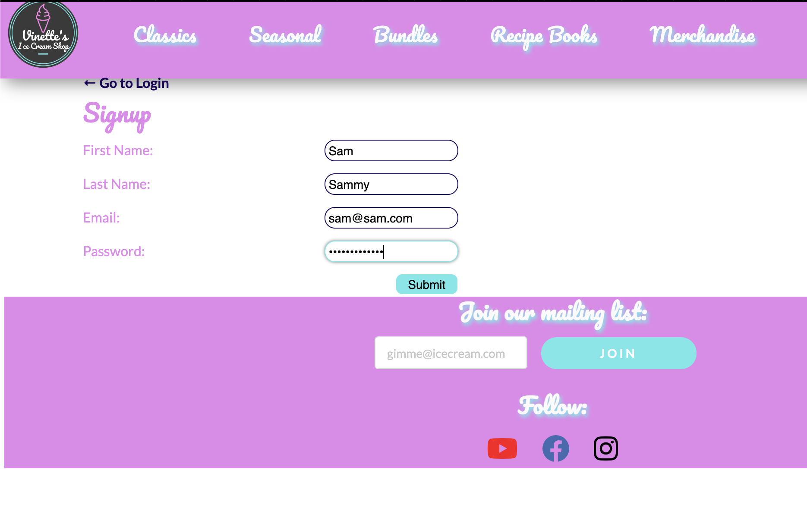
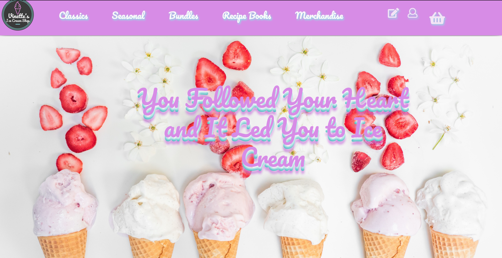
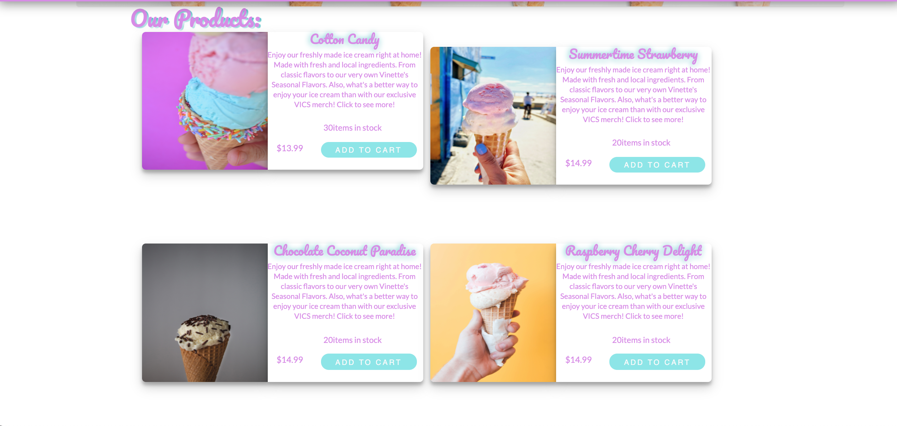
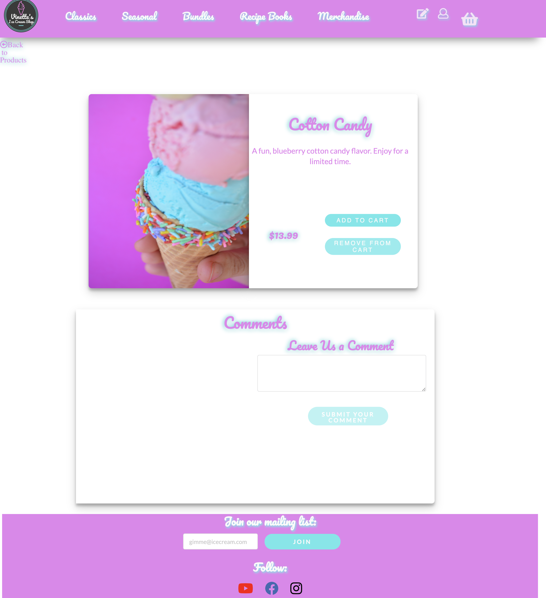
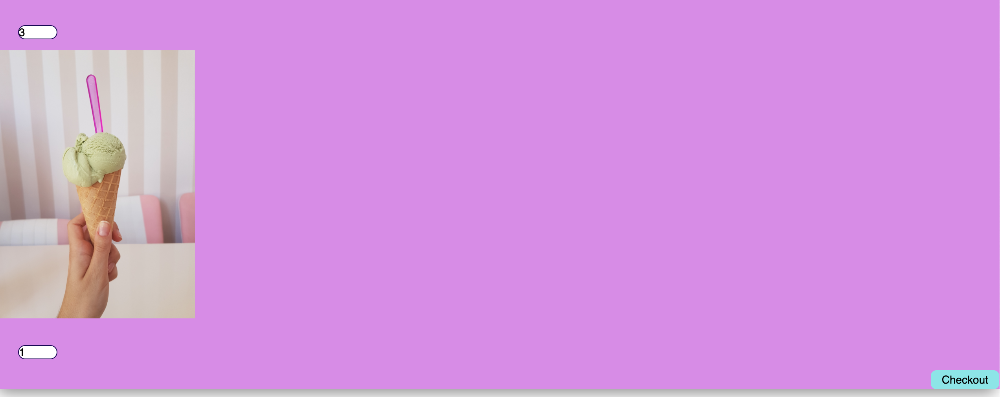
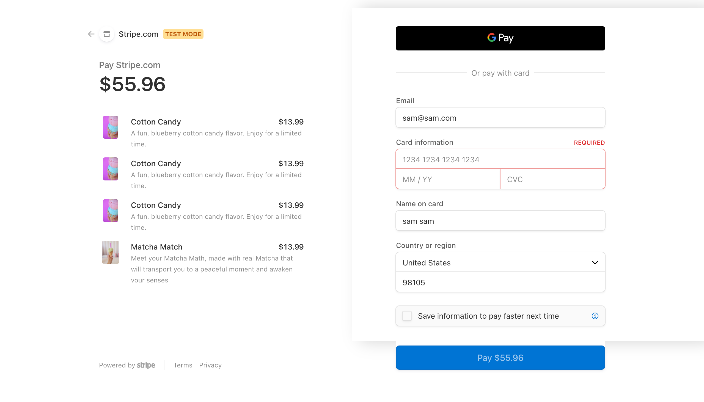

# vinette's ice cream shop 

## **Description**  
-------------
Vinette's Ice Cream Shop (VICS) is an e-commerce MERN stack web application, where users are able to buy and order local ice cream online. Users are able to browse through the various ice cream types and merchandise available for ordering. Users are able to select their product cards to learn more about each ice cream or item. Once a user has made their selection, they are able to process their order with the online payment processor using Stripe. 

 ## **How to Use**
 ---------------
- The user would start at the homepage where they are able to navigate the different caterogies using the _sticky_ navbar. A user can also sign-in if they are an existing VICS member or create an account with the icons on the right. 

-A new user can create an account from selecting the signup button on the navbar.

-The homepage features a jumbotron with the business's slogan, "You Followed Your Heart and it Led You to Ice Cream".

- Below the jumbotron, the user would find all the products currently available on the online shop. When the user wants to browse for something more specific they can use the navbar to pick a category which would update the cards with products from their respective categories. 

- The user can click on the product cards to read more about each product or purchase right from the cards. The user would be taken to the product detail page where the user can read more on each product. There they can also read comments on the products and add comments for the products if they are signed in.
  

-The user can select products and the quantity of products to fill their cart. From the cart, the user is able to checkout.

 

 -When the user selects checkout, they are taken to the payment processing page from _Stripe_. There the user is able to enter all their payment information and their order will be confirmed. Ice cream will be on it's way. 

 

## **Built With**
---------------
- 
- 
- 
- 
- 
- 

## **Contributors**
--------------------
  

- Vinette G. [GitHub](https://github.com/vinetteg)
- Rudy S. [GitHub](https://github.com/Rudys212)
- Matt K. [GitHub](https://github.com/mjkekai)
- Alex R. [GitHub](https://github.com/rileyale001)

## **License**
--------------------
MIT License

Copyright (c) 2021 Rudys212, vinetteg, mjkekai, rileyale001

Permission is hereby granted, free of charge, to any person obtaining a copy
of this software and associated documentation files (the "Software"), to deal
in the Software without restriction, including without limitation the rights
to use, copy, modify, merge, publish, distribute, sublicense, and/or sell
copies of the Software, and to permit persons to whom the Software is
furnished to do so, subject to the following conditions:

The above copyright notice and this permission notice shall be included in all
copies or substantial portions of the Software.

THE SOFTWARE IS PROVIDED "AS IS", WITHOUT WARRANTY OF ANY KIND, EXPRESS OR
IMPLIED, INCLUDING BUT NOT LIMITED TO THE WARRANTIES OF MERCHANTABILITY,
FITNESS FOR A PARTICULAR PURPOSE AND NONINFRINGEMENT. IN NO EVENT SHALL THE
AUTHORS OR COPYRIGHT HOLDERS BE LIABLE FOR ANY CLAIM, DAMAGES OR OTHER
LIABILITY, WHETHER IN AN ACTION OF CONTRACT, TORT OR OTHERWISE, ARISING FROM,
OUT OF OR IN CONNECTION WITH THE SOFTWARE OR THE USE OR OTHER DEALINGS IN THE
SOFTWARE.

## **Links** 
---------------
- [GitHub Repo](https://github.com/vinetteg/vinettesicecreamshop)

- [Deployed app in Heroku](https://cryptic-castle-30551.herokuapp.com/)
